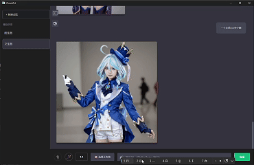
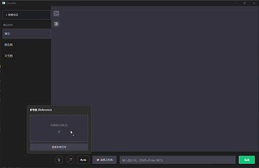

# CloudArt - 一款基于 Qt/C++ 的 AI 绘图桌面客户端

<p align="center">
  
</p>

<p align="center">
  
  
  
  
</p>

---

**CloudArt** 是一款基于会话流的沉浸式 AI 创作工作坊。它通过与本地部署的 **ComfyUI** 服务端进行异步通信，为用户提供稳定、高效、交互友好的 AI 绘图体验。

## ✨ 主要功能 (Features)

- **📝 会话式创作流**: 像聊天一样与 AI 进行多轮交互，所有上下文与历史记录清晰可追溯。
- **🧩 多工作流支持**: 通过动态加载 JSON 模板，灵活支持文生图、图生图、视觉反推、高清修复等多种 AI 功能。
- **🚀 实时异步交互**: 基于 WebSocket 实现任务进度的实时反馈，HTTP/POST 提交生成任务，保证了 UI 界面的流畅无卡顿。
- **💾 本地数据持久化**: 使用 SQLite 存储所有会话和消息记录，生成的图片保存在本地，确保用户数据安全不丢失。
- **🎨 精致的自定义UI**: 纯 C++ 代码手写全部界面，实现了深色主题、动态卡片、属性动画等现代桌面应用的用户体验。
- **⚙️ 灵活的后端配置**: 支持通过设置界面动态配置 ComfyUI 服务器地址，方便在不同网络环境下使用。

## 🛠️ 技术栈 (Tech Stack)

- **核心语言**: C++17
- **UI框架**: Qt 6 (QtWidgets)
- **构建系统**: CMake
- **网络通信**: `QNetworkAccessManager` (HTTP), `QWebSocket` (WebSocket)
- **数据存储**: `QtSql` (SQLite)
- **核心组件**: 纯代码手写 UI, `QPropertyAnimation`, `QGraphicsView`

## 🏛️ 架构设计 (Architecture)

项目采用标准的**分层架构**，实现了表现层、业务逻辑、数据和网络的高度解耦。

```
CloudArt/
└── src/
    ├── Core/       # 核心业务逻辑 (e.g., WorkflowManager)
    ├── Database/   # 数据库管理 (SQLite)
    ├── Model/      # 数据模型 (Structs, Enums)
    ├── Network/    # 网络服务 (ComfyApiService)
    └── Ui/         # 表现层 (MainWindow, Components)
```

**核心设计亮点**:
- **`WorkflowManager`**: 项目的业务核心。它通过加载预设的 ComfyUI API JSON 模板，并根据用户输入动态填充参数（如提示词、种子、图片路径）来构建最终的请求体。这种设计将易变的 AI 工作流配置与稳定的客户端业务逻辑完全分离，使得添加或修改 AI 功能无需改动核心代码，具有极高的灵活性和可维护性。
- **异步UI更新**: 利用 Qt 的信号与槽机制构建了完整的异步回调链路。通过为每个任务分配唯一 ID 并与 UI 组件进行映射，解决了在复杂的异步网络环境中，如何将返回结果精准更新到对应界面的经典难题。

## 🚀 如何运行 (Getting Started)

### 环境依赖
- Qt 6.5 或更高版本
- 编译器: MSVC 2022 或 MinGW
- [ComfyUI](https://github.com/comfyanonymous/ComfyUI) 服务端，并确保已启动。

### 编译步骤
1. 克隆本仓库:
   ```bash
   git clone https://github.com/promisekid/CloudArt.git
   ```
2. 使用 Qt Creator 打开根目录的 `CMakeLists.txt` 文件。
3. 配置项目并构建。
4. 运行前，请在程序的设置界面中配置正确的 ComfyUI 服务器地址。

## 🎬 演示 (Demo)


<p align="center">
  
  
</p>


